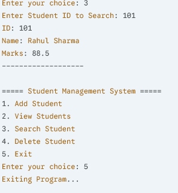

# Student-Management-system
Java Based Student Management System
A simple console-based Student Management System built using Java.  
This project allows users to manage student records with basic CRUD operations.

## Features

- Add Student
- View All Students
- Search Student by ID
- Delete Student
- Menu-driven Console Application

## Technologies Used

- Java
- ArrayList
- OOP Concepts
- Scanner Class

## Project Screenshot

## Author
Parth Bharvad
